<h3 align="center">
  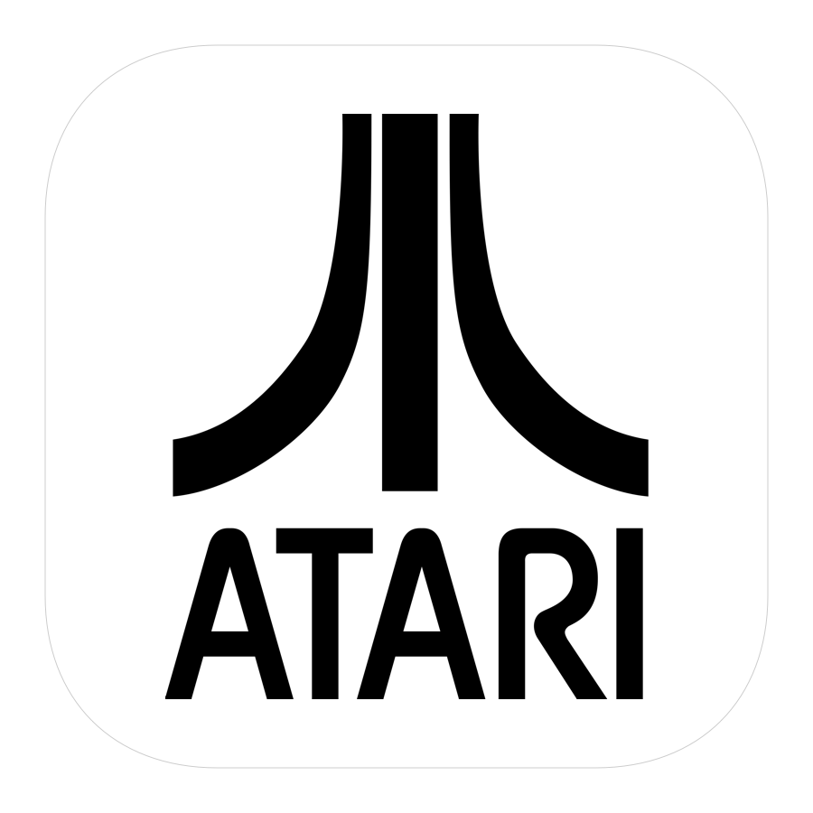
</h3>

# Atari

Research Playground built on top of [OpenAI's Atari Gym](https://gym.openai.com/envs/#atari), prepared for implementing various Reinforcement Learning algorithms.

It can emulate any of the following games:
	
> ['Asterix', 'Asteroids',
> 'MsPacman', 'Kaboom', 'BankHeist', 'Kangaroo',
> 'Skiing', 'FishingDerby', 'Krull', 'Berzerk',
> 'Tutankham', 'Zaxxon', 'Venture', 'Riverraid',
> 'Centipede', 'Adventure', 'BeamRider', 'CrazyClimber',
> 'TimePilot', 'Carnival', 'Tennis', 'Seaquest',
> 'Bowling', 'SpaceInvaders', 'Freeway', 'YarsRevenge',
> 'RoadRunner', 'JourneyEscape', 'WizardOfWor',
> 'Gopher', 'Breakout', 'StarGunner', 'Atlantis',
> 'DoubleDunk', 'Hero', 'BattleZone', 'Solaris',
> 'UpNDown', 'Frostbite', 'KungFuMaster', 'Pooyan',
> 'Pitfall', 'MontezumaRevenge', 'PrivateEye',
> 'AirRaid', 'Amidar', 'Robotank', 'DemonAttack',
> 'Defender', 'NameThisGame', 'Phoenix', 'Gravitar',
> 'ElevatorAction', 'Pong', 'VideoPinball', 'IceHockey',
> 'Boxing', 'Assault', 'Alien', 'Qbert', 'Enduro',
> 'ChopperCommand', 'Jamesbond']

Check out corresponding Medium article: [Atari - Reinforcement Learning in depth 🤖 (Part 1: DDQN)](https://towardsdatascience.com/atari-reinforcement-learning-in-depth-part-1-ddqn-ceaa762a546f)

## Purpose
The ultimate goal of this project is to implement and compare various RL approaches with atari games as a common denominator.

## Usage

1. Clone the repo.
2. Go to the project's root folder.
3. Install required packages`pip install -r requirements.txt`.
4. Launch atari. I recommend starting with help command to see all available modes `python atari.py --help`.

## DDQN
### Hyperparameters
	* GAMMA = 0.99
	* MEMORY_SIZE = 900000
	* BATCH_SIZE = 32
	* TRAINING_FREQUENCY = 4
	* TARGET_NETWORK_UPDATE_FREQUENCY = 40000
	* MODEL_PERSISTENCE_UPDATE_FREQUENCY = 10000
	* REPLAY_START_SIZE = 50000
	* EXPLORATION_MAX = 1.0
	* EXPLORATION_MIN = 0.1
	* EXPLORATION_TEST = 0.02
	* EXPLORATION_STEPS = 850000

### Model Architecture
Deep Convolutional Neural Network by [DeepMind](https://www.cs.toronto.edu/~vmnih/docs/dqn.pdf)

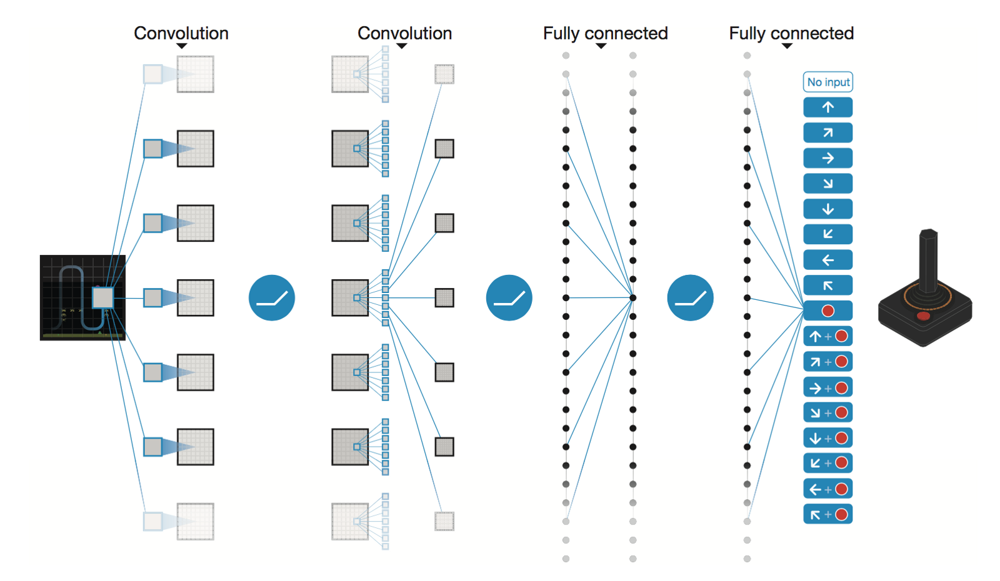

	* Conv2D (None, 32, 20, 20)
	* Conv2D (None, 64, 9, 9)
	* Conv2D (None, 64, 7, 7)
	* Flatten (None, 3136)
	* Dense (None, 512)
	* Dense (None, 4)
	
	Trainable params: 1,686,180

### Performance
After 5M of steps (**~40h** on Tesla K80 GPU or **~90h** on 2.9 GHz Intel i7 Quad-Core CPU):

#### SpaceInvaders

*Training:*

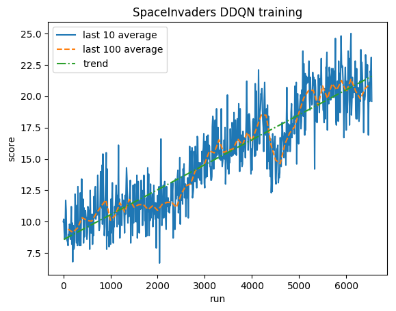

Normalized score - each reward clipped to (-1, 1)

*Testing:*

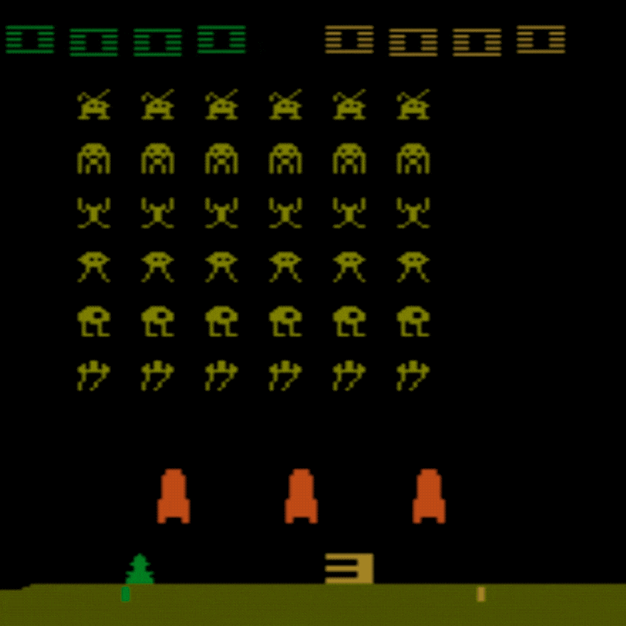

Human average: **~372**

DDQN average: **~479 (128%)**

---

#### Breakout

*Training:*

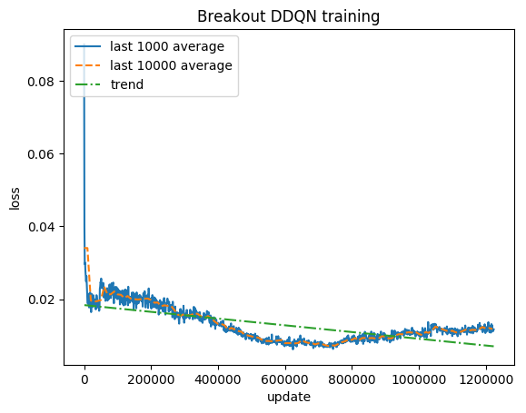
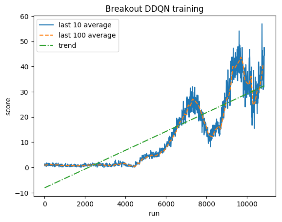

Normalized score - each reward clipped to (-1, 1)

*Testing:*

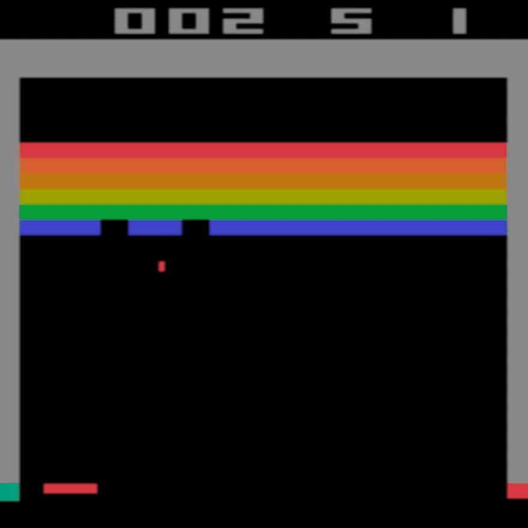
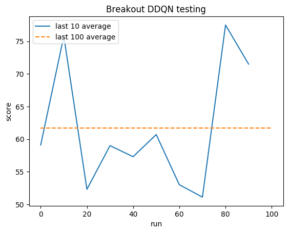

Human average: **~28**

DDQN average: **~62 (221%)**

## Genetic Evolution

#### Atlantis

*Training:*

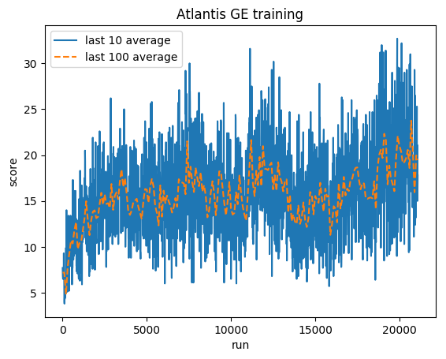

Normalized score - each reward clipped to (-1, 1)

*Testing:*

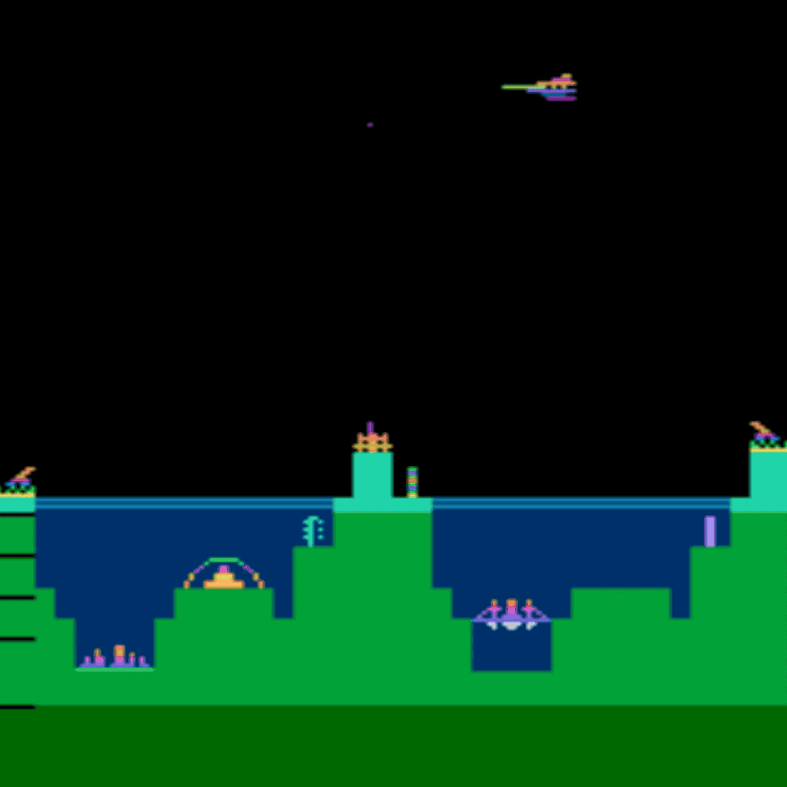
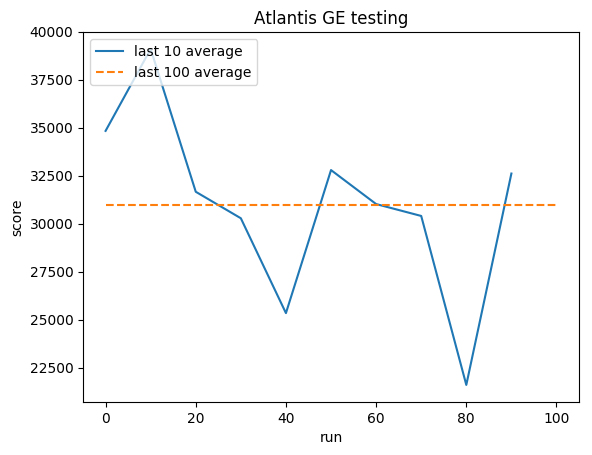

Human average: **~29,000**

GE average: **31,000 (106%)**

## Author

**Greg (Grzegorz) Surma**

[**PORTFOLIO**](https://gsurma.github.io)

[**GITHUB**](https://github.com/gsurma)

[**BLOG**](https://medium.com/@gsurma)

